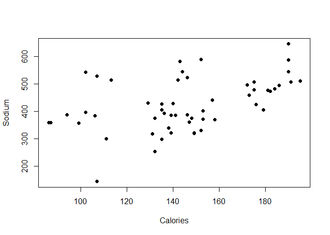
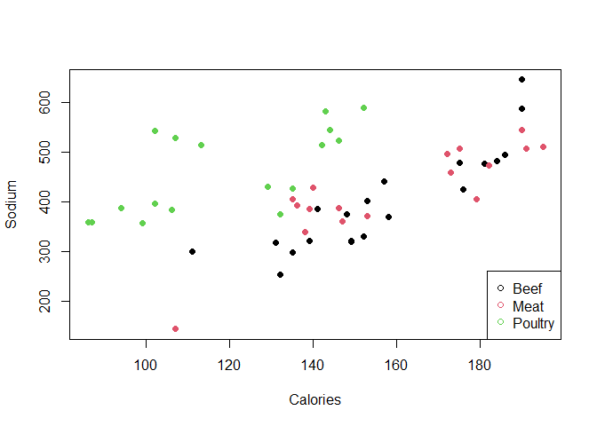
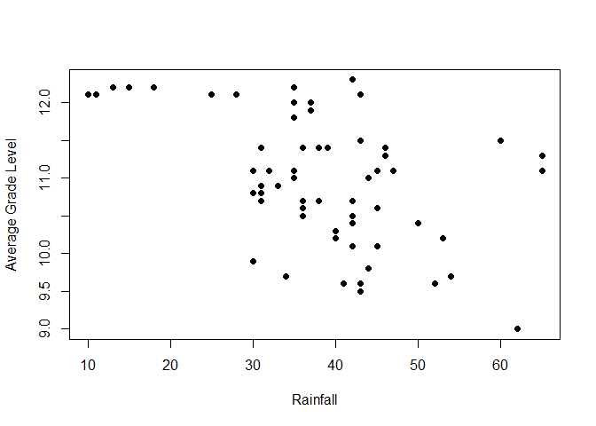
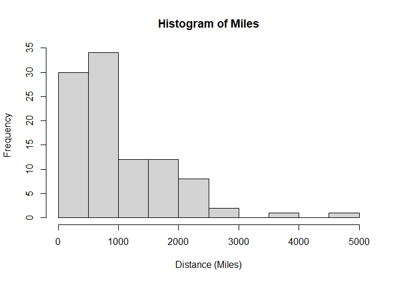
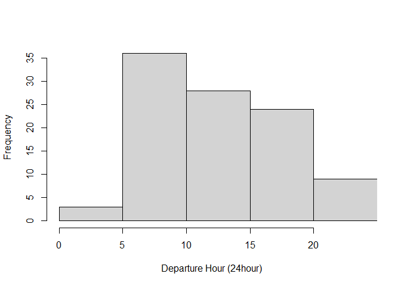
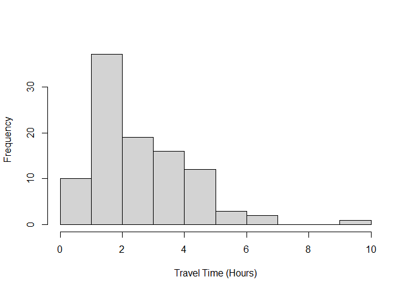
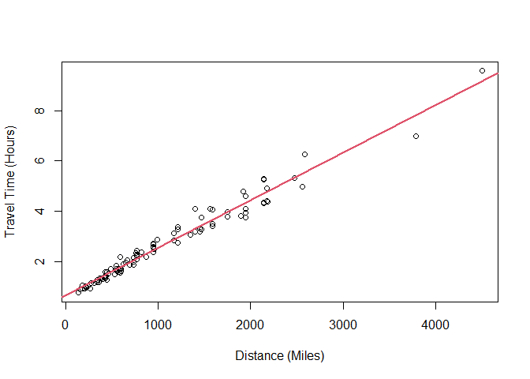
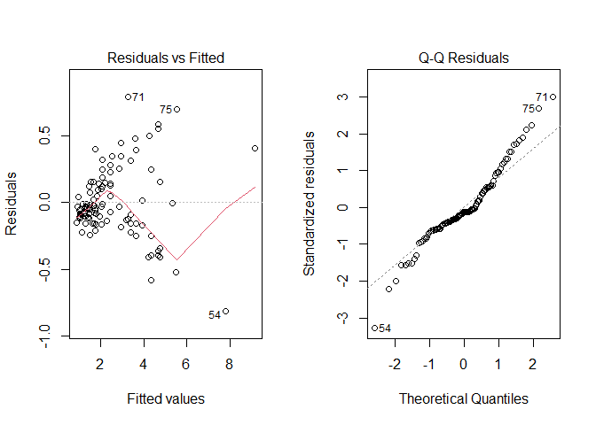

# Introduction

This is a demonstration file to go in lecture 01. Your version will be a
bit shorter.

# Housekeeping

Come back to this lab and rerun these lines if you switch machines or
get disconnected.

Run these lines in interactive mode (you can copy-and-paste them but
you’ll have to make them specific to yourself).

      library(usethis, gitcreds)

      #if that doesn't work, install the packages and try the previous    line again.
      install.packages("usethis")  #These should only be needed once
      install.packages("gitcreds") 
      

-   Let git know about your github username and email by editing this as
    appropriate and entering it into the Console:

I put
`usethis::use_git_config(   scope = "user",   user.name = "Tanzy Love",   user.email = "Tanzy_Love@urmc.rochester.edu")`

-   There are a couple of ways to connect to GitHub now with Two Factor
    Authentication (2FA). However you do it is fine.

-   If you don’t set up 2FA, we need to set up a personal access token
    so that you can write from rstudio to github. To do this, enter use
    the following command into the Console; pick a 6 month expiration:

        usethis::create_github_token()

    Follow the instructions. **Be sure to save the PAT in a password
    manager**, you will have to re-enter it, depending on your set-up.

        gitcreds::gitcreds_set()

    paste in the token from the last step. If you picked this token to
    have a 6 month expiration, you shouldn’t have to do this again.

# Getting started

Each of your assignments will begin with the following steps. You can
always refer back to this lab for a detailed list of the steps involved
for getting started with an assignment.

This part you will do every time you have an assignment or lab.

-   Click on the assignment link that you should have received in your
    email to create your GitHub repository (which we’ll refer to as
    “repo” going forward) for the assignment. This repo contains a
    template you can build on to complete your assignment.

-   Note that it’s not in *your* GitHub folder, it’s in the coursespace
    (so I can see it but you can’t see each other’s) and it is a copy of
    the template that I made to be here.

Either:

-   On GitHub, click on the clipboard icon to copy the repo URL. It will
    start with the class “bst-urmc” and end with your username
    “tanzylove” (for me) and the middle is based on what the assignment
    is named.

-   Open RStudio and pick {}. Paste in the repo URL from github

Or:

-   On GitHub, click on the green **Clone or download** button, select
    **Use HTTPS** (this might already be selected by default, and if it
    is, you’ll see the text **Clone with HTTPS** as in the image below).
    Click on the clipboard icon to copy the repo URL. It will start with
    the class “bst-urmc” and end with your username “tanzylove” (for me)
    and the middle is based on what the assignment is named.

-   Go to RStudio clone the assignment repository. This is the one copy
    and paste into RStudio part that you will do each time you start to
    work.

<!-- -->

    ###  #'s comment out lines in R code

    #you need to change this to the right repository and location for you and your local machine
    usethis::create_from_github("https://github.com/bst-urmc/setup-check-assignment-0-tanzylove",
       destdir="~/Documents/teaching/bst430/")

-   If you need to login to github, a login box should pop up.
-   It opens up a new copy of RStudio with all the files from the
    repository in question.

# Data

Now, for the statistics!!!

Read in some data.

    hotdogs=read.table("Hdcalsod.TXT", header=T)

    colnames(hotdogs)

    ## [1] "Type"     "Calories" "Sodium"

    hotdogs$Calories

    ##  [1] 186 181 176 149 184 190 158 139 175 148 152 111 141 153 190 157 131 149 135
    ## [20] 132 173 191 182 190 172 147 146 139 175 136 179 153 107 195 135 140 138 129
    ## [39] 132 102 106  94 102  87  99 107 113 135 142  86 143 152 146 144

    attach(hotdogs)

    plot(Calories, Sodium, xlab="Calories", ylab="Sodium", pch=16)

    cor(Calories, Sodium)

    ## [1] 0.4671387

    plot(Calories, Sodium, xlab="Calories", ylab="Sodium", 
        col=factor(Type), pch=16)
    legend("bottomright", levels(factor(Type)), col=1:3, pch=1)

Let’s try a different data set. This one about 50 states.

    hsgrads=read.table("raingrad.TXT", header=T, sep="\t")
    attach(hsgrads)

    plot(Rain, Education, 
          xlab="Rainfall", ylab="Average Grade Level", pch=16)

    cor(Rain, Education)

    ## [1] -0.4758416

    args(cor)

    ## function (x, y = NULL, use = "everything", method = c("pearson", 
    ##     "kendall", "spearman")) 
    ## NULL

And one final set of flying times.

    delta=read.table("Deltafly.TXT", header=T)
    attach(delta)

    hist(Miles, xlab="Distance (Miles)")

    hist(DepHr, main=NULL, xlab="Departure Hour (24hour)", xlim=c(0,24))

    hist(TravTime, main=NULL, xlab="Travel Time (Hours)")

    plot(Miles, TravTime, xlab="Distance (Miles)", ylab="Travel Time (Hours)")
    cor(Miles, TravTime)

    ## [1] 0.9850281

    reg.line=lm(TravTime~Miles) #calcuate the regression line for the Delta data
    summary(reg.line)

    ## 
    ## Call:
    ## lm(formula = TravTime ~ Miles)
    ## 
    ## Residuals:
    ##      Min       1Q   Median       3Q      Max 
    ## -0.81510 -0.13912 -0.03479  0.14409  0.79419 
    ## 
    ## Coefficients:
    ##              Estimate Std. Error t value Pr(>|t|)    
    ## (Intercept) 6.463e-01  4.340e-02   14.89   <2e-16 ***
    ## Miles       1.894e-03  3.349e-05   56.56   <2e-16 ***
    ## ---
    ## Signif. codes:  0 '***' 0.001 '**' 0.01 '*' 0.05 '.' 0.1 ' ' 1
    ## 
    ## Residual standard error: 0.2662 on 98 degrees of freedom
    ## Multiple R-squared:  0.9703, Adjusted R-squared:   0.97 
    ## F-statistic:  3199 on 1 and 98 DF,  p-value: < 2.2e-16

    abline(reg.line, col=2, lwd=2)

    par(mfrow=c(1,2)) #make both plots appear together
    plot(reg.line, which=1:2)  # plot residual assumption plots

    par(mfrow=c(1,1)) #make only one plot appear at a time

## Make a change:

Make a new file in RStudio or change the name in the header of this
“lab00-hello-class.Rmd” file.

## Commiting changes:

-   Then Go to the Git pane (next to Environment and History) in your
    RStudio.

-   If you created a new file, you shoud see it’s name here.

-   If you have made changes to your Rmd file, you should see it listed
    here. Click on the change to select it in this list and then click
    on **Diff**. This shows you the *diff*erence between the last
    committed state of the document and its current state that includes
    your changes.

-   If you’re happy with these changes, write “Update author name” in
    the **Commit message** box and hit **Commit**.

You don’t have to commit after every change, this would get quite
cumbersome. You should consider committing states that are *meaningful
to you* for inspection, comparison, or restoration. In the first few
assignments we will tell you exactly when to commit and in some cases,
what commit message to use. As the semester progresses we will let you
make these decisions.

## Pushing changes:

Now that you have made an update and committed this change, it’s time to
push these changes to the web! Or more specifically, to your repo on
GitHub. Why? So that others can see your changes. And by others, we mean
the course teaching team (your repos in this course are private to you
and us, only).

In order to push your changes to GitHub, click on **Push**. This will
prompt a dialogue box where you first need to enter your user name, and
then your PAT.

*Yay, you’re done! Commit all remaining changes, use the commit message
“Done with Lab 0!”, and push. Before you wrap up the assignment, make
sure all documents are updated on your GitHub repo.*

*comments in RMarkdown are between stars, don’t pad with spaces*

## Rubric (0 points possible)

You may not be able to do this on your own after lecture 0, so don’t
worry about it!!
